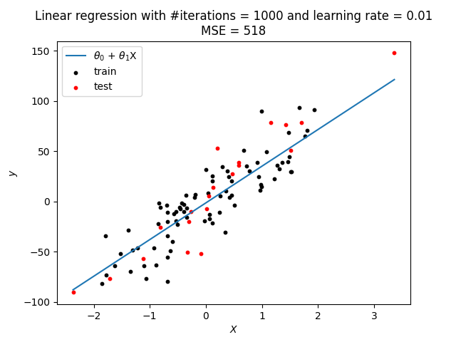

# Linear Regression

Here we want to implement linear regression from scratch. We have $y\in\mathbb{R}$, and take the simplest example, for which $x\in\mathbb{R}$.

We'll choose as our hypothesis 
$$
h_\theta(x) = \theta_0 + \theta_1x.
$$
Therefore our aim is to find $\theta$ such that we minimize the cost function $J(\theta)$:
$$
\min_\theta J(\theta) = \frac{1}{m}\sum_{i=1}^m(\hat{y}^{(i)} - y^{(i)})^2,
$$
where $m$ is the number of training examples.

### Updates
We'll use gradient descent and update $\theta$ as $\theta := \theta - \alpha\frac{\partial J}{\partial\theta}$, where $\alpha$ is the learning rate. Working through the algebra gives
$$
\frac{\partial J}{\partial\theta_0} = \frac{2}{m}\sum_{i=1}^m(\hat{y}^{(i)} - y^{(i)})
\\
\frac{\partial J}{\partial\theta_1} = \frac{2}{m}\sum_{i=1}^mx^{(i)}(\hat{y}^{(i)} - y^{(i)})
$$
and we note that we can drop the factors of $2/m$ since they simply scale the result.

## Results

We can see that the algorithm converged as expected to a sensible solution with MSE = 518.

