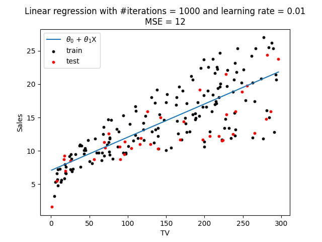

# Linear Regression

Here we want to implement linear regression from scratch. We have $y\in\mathbb{R}$, and take the simplest example, for which $x\in\mathbb{R}$.

We'll choose as our hypothesis 
$$
h_\theta(x) = \theta_0 + \theta_1x.
$$
Therefore our aim is to find $\theta$ such that we minimize the cost function $J(\theta)$:
$$
\min_\theta J(\theta) = \frac{1}{m}\sum_{i=1}^m(\hat{y}^{(i)} - y^{(i)})^2,
$$
where $m$ is the number of training examples.

### Updates
To optimise our cost function, i.e. find those $\theta$ that best satisfy $h_\theta\approx y$ for our training data, we use the batch gradient descent (GD) algorithm. This starts with some $\theta$ — initialised either randomly or at 0 — and repeatedly performs the update
$$
\theta_j := \theta_j - \alpha\frac{\partial}{\partial\theta_j},
$$
where $\alpha$ is the learning rate, which scales the size of step that the algorithm takes at each iteration. Note that $j\in\{0,1,\ldots,n\}$ for $n$ features (in our case $n\in\{0,1\}$) and batch GD iterates over every feature for every training example for each step.

Working through the algebra for our case gives the following updates for the feature vector at each step
$$
\frac{\partial J}{\partial\theta_0} = \frac{2}{m}\sum_{i=1}^m(\hat{y}^{(i)} - y^{(i)}),
\\
\frac{\partial J}{\partial\theta_1} = \frac{2}{m}\sum_{i=1}^mx^{(i)}(\hat{y}^{(i)} - y^{(i)}),
$$
and we note that we can drop the factors of $2/m$ since they simply scale the result.

## Results

We can see that the algorithm converged to a solution with MSE = 518, giving a RMSE of around 23, which looks sensible for the given dataset. 

The implementation was also tested on a more realistic [dataset](https://www.kaggle.com/datasets/devzohaib/tvmarketingcsv) containing TV marketing spends and corresponding sales figures (see `advertising_test.py` for the implementation; note that an extra standardization step was required for the algorithm to converge). Results are plotted below and again seem an OK fit. 

